<picture>
    <source media="(prefers-color-scheme: dark)" srcset="assets/header-dark.svg" />
    
  </picture>

<picture>
    <source media="(prefers-color-scheme: dark)" srcset="assets/skills-dark.svg" />
    
  </picture>

<a href="https://www.linkedin.com/in/hafsa-tayyab-4ab566317">
  <picture>
    <source media="(prefers-color-scheme: dark)" srcset="assets/linkedin-dark.svg" />
    
  </picture>
</a>
<a href="mailto:hafsatayyab681@gmail.com">
  <picture>
    <source media="(prefers-color-scheme: dark)" srcset="assets/email-dark.svg" />
    
  </picture>
</a>

<picture>
    <source media="(prefers-color-scheme: dark)" srcset="assets/divider-dark.svg" />
    
  </picture>

<picture>
  <source media="(prefers-color-scheme: dark)" srcset="https://raw.githubusercontent.com/Hafsa-Tayyab/Hafsa-Tayyab/output/github-snake-dark.svg" />
  <source media="(prefers-color-scheme: light)" srcset="https://raw.githubusercontent.com/Hafsa-Tayyab/Hafsa-Tayyab/output/github-snake.svg" />
  
</picture>

<picture>
    <source media="(prefers-color-scheme: dark)" srcset="assets/footer-dark.svg" />
    
  </picture>

